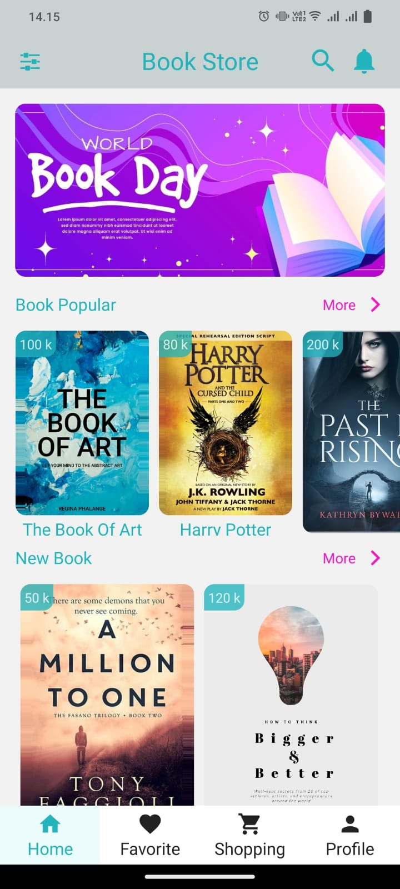
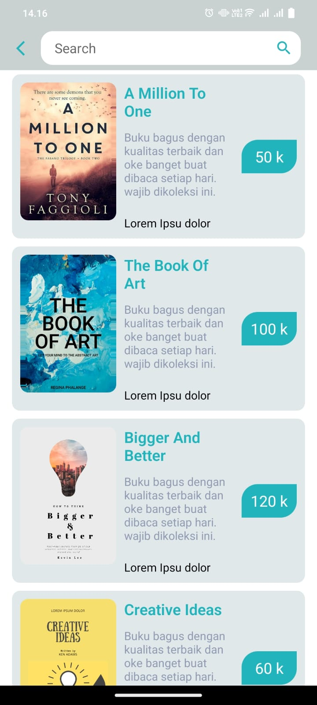
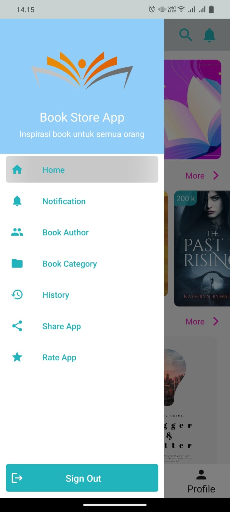
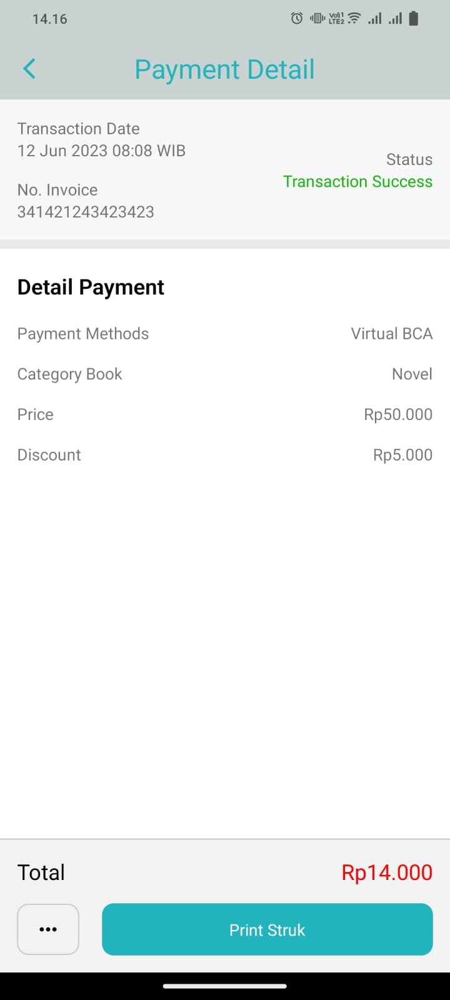
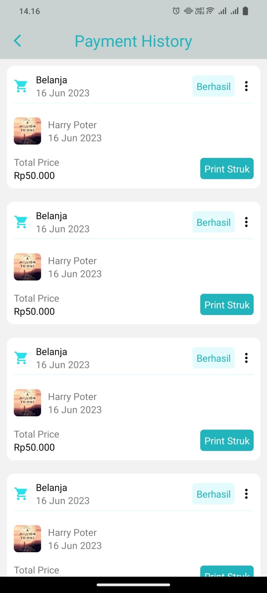

# BookStore

This project is an implementation for a store focused on selling books online

<!-- Nice movie adalah aplikasi yang digunakan untuk melihat daftar film. Aplikasi ini dibangun menggunakan arsitekrur MVVM.
Adapun library yang digunakan yaitu SDWebImage.

Note: Jangan lupa untuk pod install -->

[BookStore DOWNLOAD](https://github.com/eldirb21/BookStore/releases)

Here are the views of the application:

&nbsp;&nbsp;&nbsp;&nbsp;&nbsp;
&nbsp;&nbsp;&nbsp;&nbsp;&nbsp;
&nbsp;&nbsp;&nbsp;&nbsp;&nbsp;
&nbsp;&nbsp;&nbsp;&nbsp;&nbsp;
&nbsp;&nbsp;&nbsp;&nbsp;&nbsp;

